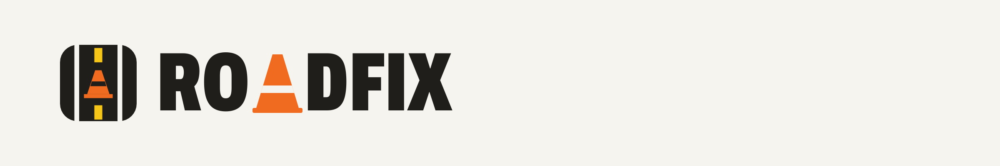
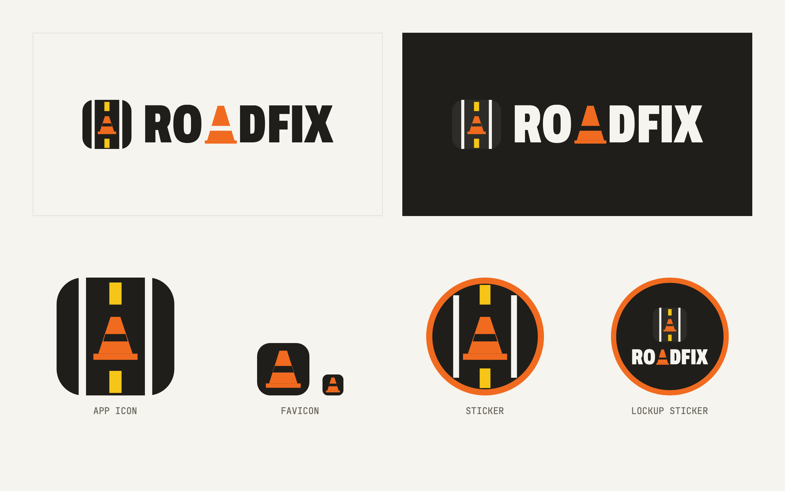

# RoadFix — React + TypeScript

RoadFix is a civic infrastructure app for NSW councils. Residents report road defects, contractors fix them, admins triage.

Built for the Central West NSW pilot (Orange, Cabonne, Blayney, Cowra LGAs) as part of the Charles Darwin University PRT631 Information Systems Practicum.

## Brand



All RoadFix artwork lives in `src/Logos/`:

| File | Used for |
| --- | --- |
| `logo-transparent-black.png` / `logo-transparent-white.png` | Navbar, footer, sign-in/register (light / dark theme, via trimmed copies) |
| `logo-light.png` / `logo-dark.png` | Home page call-to-action banner (light / dark theme); `logo-dark` is also the social share image |
| `favicon.png` | Browser tab icon |
| `app-icon-rounded.png` | iOS home-screen icon (`apple-touch-icon`) |
| `app-icon-1024.png` / `social-avatar.png` | PWA manifest icons (standard / maskable) |
| `sticker-lockup.png` / `sticker-icon.png` | Sign-in / register brand panel illustrations |
| `vehicle-decal.png` | Contractor "My jobs" banner |
| `website-header.png`, `roadfix-all-in-one.png` | This README |
|  `wordmark-transparent.png` | Text-only wordmark for print and light backgrounds |

Files in `public/` (favicon, icons, `og-image.png`) are copies of the originals, since `index.html` and the manifest need fixed URLs.

## Stack

- **React 18** + **TypeScript 5** — strict typing throughout
- **Vite 5** — fast dev server and build
- **Tailwind CSS 3** — utility-first styling with CSS-var-based theming
- **React Router 7** — single-page app with normal (search-engine friendly) URLs
- **Zustand 4** — tiny state store for auth + UI
- **Supabase JS 2** — Postgres backend with auth and row-level security
- **Leaflet + React-Leaflet** — OpenStreetMap tiles, custom pins

## Quick start

```bash
npm install
npm run dev
```

Open http://localhost:5173. `.env.local` already points at a live Supabase project, so this is a
real backend from the first run — no in-memory dummy data. (An offline demo-data fallback still
exists in `src/lib/api.ts` and activates automatically if `.env.local` is removed or unset, purely
so the UI can be previewed without a backend — it never runs while Supabase is configured.)

## Accounts

Register a real account at `/register` (citizen or contractor). The admin account is
`council@gmail.com` — sign it up, then run `supabase/00-all-in-one.sql` to grant the admin role.

Admin accounts and contractor↔company links are granted via a one-line SQL update by an existing
admin, not via self-registration — see `docs/02-SUPABASE.md`.

The whole database is set up by one file, run once in the Supabase SQL Editor:
`supabase/00-all-in-one.sql` (wipes old data, creates everything, no dummy data).

## Project structure

```
roadfix/
├─ src/
│  ├─ main.tsx              React entry, mounts App, inits stores
│  ├─ App.tsx               Router — all routes with role guards
│  ├─ index.css             Design tokens + Tailwind + component classes
│  ├─ lib/
│  │   ├─ types.ts          Every shared type (Defect, Profile, Role, …)
│  │   ├─ constants.ts      STATUS, SEVERITY, TYPES, ORANGE (lat/lng)
│  │   ├─ utils.ts          relativeTime, daysAgo, initialsOf, newDefectId
│  │   ├─ icons.tsx         Lucide-style SVG icon set
│  │   ├─ supabase.ts       Typed client + HAS_SUPABASE detection
│  │   └─ api.ts            Data layer — Supabase queries + demo fallback
│  ├─ store/
│  │   ├─ auth.ts           Zustand — session, profile, role, demo mode
│  │   └─ ui.ts             Zustand — theme, toasts, modal host
│  ├─ components/
│  │   ├─ Layout.tsx        Navbar + TabBar + Footer
│  │   ├─ DefectMap.tsx     Leaflet map with severity-colored pins
│  │   ├─ DefectCard.tsx    Card with photo, status, severity, progress
│  │   ├─ Timeline.tsx      Repair-progress timeline
│  │   ├─ StatCard.tsx      Number-with-label card
│  │   ├─ Badge.tsx         StatusBadge
│  │   ├─ Severity.tsx      SeverityChip (with critical pulse)
│  │   ├─ Placeholder.tsx   Dashed image placeholder
│  │   ├─ Toast.tsx         Toast host (4 kinds: success/error/warning/info)
│  │   ├─ Modal.tsx         Modal host (assign/reject dialogs)
│  │   └─ ProtectedRoute.tsx  Guards routes by role
│  └─ pages/
│      ├─ Home.tsx          Landing — hero, stats, how-it-works, recent
│      ├─ Login.tsx         Split-screen login
│      ├─ Register.tsx      Role selector + create account
│      ├─ Dashboard.tsx     Citizen dashboard
│      ├─ Report.tsx        3-step report form (location → details → photo)
│      ├─ Defects.tsx       All defects — filters + map/grid/table views
│      ├─ DefectDetail.tsx  Full defect view — actions by role
│      ├─ MyReports.tsx     Citizen — my own reports
│      ├─ Contractor.tsx    Contractor kanban (assigned/progress/completed)
│      └─ Admin.tsx         Council dashboard — charts, contractors, triage
├─ supabase/
│  └─ 00-all-in-one.sql     Wipe + full schema, RLS, followers, storage (no seed data)
├─ docs/                    Setup, Supabase, deployment, troubleshooting
├─ package.json
├─ vite.config.ts
├─ tailwind.config.ts
├─ tsconfig.json
├─ .env.example
└─ .gitignore
```

## User flows

### Citizen
1. `/` → `/register` (role = citizen)
2. `/dashboard` shows their stat cards + recent reports + neighbourhood map
3. `/report` — pick location on the map → choose type/severity/title → attach photos → submit
4. `/my-reports` shows all their submissions with filter tabs
5. `/defect/:id` shows full details; the **Follow updates** and **Back this report** buttons are visible

### Contractor
1. `/login` (email starting with `contractor@` in demo mode)
2. `/contractor` shows a kanban with three columns: Assigned / In progress / Completed
3. Click a card → `/defect/:id`
4. **Mark in progress** and **Mark complete** buttons write to the repair timeline

### Admin
1. `/login` (email starting with `admin@`)
2. `/admin` shows the program overview: stat cards, status bar chart, severity breakdown, contractor performance table, live map, pending triage list
3. Click a pending defect → `/defect/:id`
4. **Assign contractor** opens a modal with the panel
5. **Reject report** opens a modal with reason chips + free text

## Design tokens

All theming is driven by CSS custom properties in `src/index.css`:

- **Brand**: `#1E40AF` blue
- **Success (em)**: `#059669` green (completed repairs)
- **Warning (am)**: `#F59E0B` amber (assigned, in progress)
- **Danger (rd)**: `#DC2626` red (critical, rejected)
- **Purple (pu)**: `#7C3AED` (contractor accents)

Both **light** and **dark** themes are supported via the toggle in the navbar. Preference persists in `localStorage`.

## Author

**Nabin Pandey** — PRT631 Information Systems Practicum
Charles Darwin University · 2026

## License

MIT — free to use for research and educational purposes.
